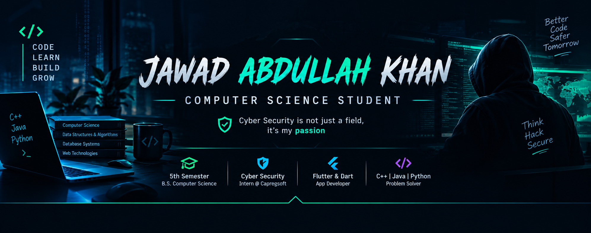

  

  

  

## 🙋 About Me

I'm a **Computer Science student** and undergraduate currently gaining hands-on industry experience while building a strong foundation in programming, databases, and mobile app development.

- 🎓 **B.S. Computer Science** — 5th Semester
- 🛡️ **Cyber Security is my passion**
- 💼 Cyber Security Intern @ **Capregsoft Pvt Ltd**, Islamabad
- 📱 Building cross-platform apps with **Flutter & Dart**
- 🧠 Strong grasp of **C++, Java, Python, and OOP concepts**
- 🗄️ Advanced working knowledge of **MySQL** database design & optimization
- 🔎 Hands-on with **network recon, web app pentesting & vulnerability scanning**
- 💉 Practicing **manual SQL injection** and automated exploitation with **SQLMap**
- 📍 Based in **Pakistan**
- 📫 [jawadabdullah525@gmail.com](mailto:jawadabdullah525@gmail.com)

<table>
<tr>
<td width="50%" valign="top">

### 👤 Profile

| | |
|---|---|
| **Name** | Jawad Abdullah Khan |
| **Degree** | B.S. Computer Science |
| **Role** | Cyber Security Intern |
| **Semester** | 5th |
| **Passion** | Cyber Security 🛡️ |
| **Focus** | Penetration Testing |
| | Flutter App Development 📱 |

</td>
<td width="50%" valign="top">

### 🟢 Currently Learning

- Web App Pentesting
- Flutter State Management
- Network Security
- Vulnerability Assessment

</td>
</tr>
</table>

## 💻 Tech Stack

### Languages
`C++` `Java` `Python` `Dart`

### Mobile App Development
`Flutter` `Firebase` `Android Studio`

### Databases
`MySQL` `MongoDB`

### Tools
`Git` `GitHub` `VS Code`

### Core Skills

## 🛡️ Security Toolkit

| 🔎 Recon & Scanning | 🌐 Web App Testing | 💉 Injection & Exploitation | 🧪 Vulnerability Assessment |
|---|---|---|---|
| Nmap | Burp Suite | SQL Injection | OpenVAS / GVM |
| Nikto | OWASP ZAP | SQLMap | Nessus |

> 🎯 Hands-on experience scanning, enumerating, and assessing web applications and networks for vulnerabilities as part of my internship at **Capregsoft Pvt Ltd, Islamabad**.

## 🎓 Education & Internship

**B.S. Computer Science — 5th Semester**  

**Cyber Security Intern — Capregsoft Pvt Ltd**  
*Islamabad, Pakistan*

Working with **Network Security**, **Vulnerability Scanning**, and **Web App Pentesting** fundamentals using industry-standard tools.

## 📊 GitHub Analytics

## 🏆 Trophies

## 📫 Let's Connect

**"Breaking things to build them safer — and building apps people love to use."**

Consistency, curiosity, and hands-on practice — that's how I'm building my path as a Computer Science student with a passion for Cyber Security & Flutter development.

