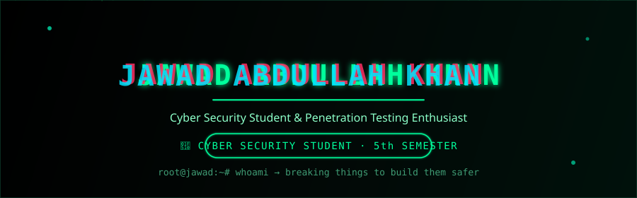

  

  

  

## 🙋 About Me

<table width="100%">
<tr>
<td width="55%" valign="top">

I'm a **Cyber Security student** and Computer Science undergraduate, currently gaining hands-on industry experience while building a strong foundation in programming, databases, and mobile app development.

🎓 **Cyber Security Student** — 5th Semester, B.S. Computer Science
🛡️ Cyber Security Intern @ **Capregsoft Pvt Ltd**, Islamabad
📱 Building cross-platform apps with **Flutter & Dart**
🧠 Strong grasp of **C++, Java, Python, and OOP concepts**
🗄️ Advanced working knowledge of **MySQL** database design & optimization
🔎 Hands-on with **network recon, web app pentesting & vulnerability scanning**
💉 Practicing **manual SQL injection** and automated exploitation with **SQLMap**
📍 Based in **Pakistan**
📫 Reach me at [jawadabdullah525@gmail.com](mailto:jawadabdullah525@gmail.com)

</td>
<td width="45%" valign="top">

<table>
<tr><td>

🟢 🔵 🔴

| | |
|:--|:--|
| **Name** | Jawad Abdullah Khan |
| **Student** | 🎓 Cyber Security Student |
| **Role** | Cyber Security Intern |
| **Degree** | B.S. Computer Science |
| **Reg No** | FA24-BCS-110 |
| **Section** | 5 C |
| **Semester** | 5th |
| **Focus** | Penetration Testing 🛡️ |
| | Flutter App Development 📱 |

</td></tr>
</table>

</td>
</tr>
</table>

  

## 💻 Tech Stack

<marquee behavior="scroll" direction="left" scrollamount="6">
  
</marquee>

**Languages**

<table>
<tr>
<td align="center" width="110"> <b>C++</b></td>
<td align="center" width="110"> <b>Java</b></td>
<td align="center" width="110"> <b>Python</b></td>
<td align="center" width="110"> <b>Dart</b></td>
</tr>
</table>

**Mobile App Development**

<table>
<tr>
<td align="center" width="110"> <b>Flutter</b></td>
<td align="center" width="110"> <b>Firebase</b></td>
<td align="center" width="110"> <b>Android Studio</b></td>
</tr>
</table>

**Databases**

<table>
<tr>
<td align="center" width="110"> <b>MySQL</b></td>
<td align="center" width="110"> <b>MongoDB</b></td>
</tr>
</table>

**Tools**

<table>
<tr>
<td align="center" width="110"> <b>Git</b></td>
<td align="center" width="110"> <b>GitHub</b></td>
<td align="center" width="110"> <b>VS Code</b></td>
</tr>
</table>

**Core Skills**

  
  
  
  
  
  

## 🛡️ Security Toolkit

<table width="100%">
<tr>
<th align="center" width="25%">🔎 Recon &amp; Scanning</th>
<th align="center" width="25%">🌐 Web App Testing</th>
<th align="center" width="25%">💉 Injection &amp; Exploitation</th>
<th align="center" width="25%">🧪 Vulnerability Assessment</th>
</tr>
<tr>
<td align="center">
 

</td>
<td align="center">
 

</td>
<td align="center">
 

</td>
<td align="center">
 

</td>
</tr>
</table>

> 🎯 Hands-on experience scanning, enumerating, and assessing web applications and networks for vulnerabilities as part of my internship at **Capregsoft Pvt Ltd, Islamabad** — combining recon tools, vulnerability scanners, and manual exploitation techniques like SQL injection.

## 🎓 Education &amp; Internship

<table>
<tr>
<td width="8%" align="center" valign="top">🎓</td>
<td width="92%">

**B.S. Computer Science — Cyber Security Student**
*Reg No: FA24-BCS-110 · Section: 5 C · Currently in 5th Semester*

Coursework:

</td>
</tr>
</table>

<table>
<tr>
<td width="8%" align="center" valign="top">🏢</td>
<td width="92%">

**Cyber Security Intern** — Capregsoft Pvt Ltd
*Islamabad, Pakistan*

Working with ,  and  fundamentals using industry-standard tools

</td>
</tr>
</table>

## 📊 GitHub Analytics

  
  

  

  

## 🏆 Trophies

  

## 📫 Let's Connect

  

  
  
  

📧 **Email:** [jawadabdullah525@gmail.com](mailto:jawadabdullah525@gmail.com)
🔗 **LinkedIn:** [sardar-jawad-abdullah-khan](https://www.linkedin.com/in/sardar-jawad-abdullah-khan-73ba4a394?utm_source=share_via&utm_content=profile&utm_medium=member_android)

  

<h2 align="center">"Breaking things to build them safer — and building apps people love to use."</h2>

  <i>Consistency, curiosity, and hands-on practice — that's how I'm building my path as a cyber security student &amp; Flutter developer.</i>

